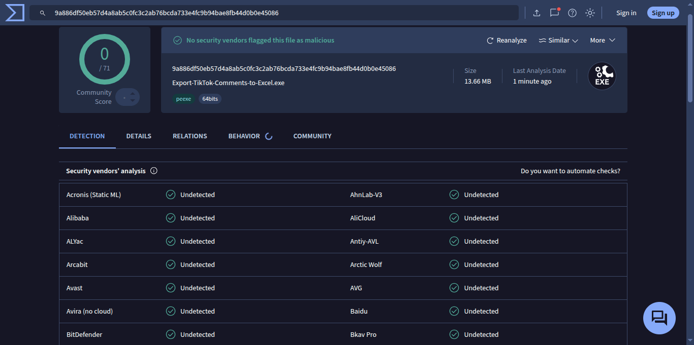
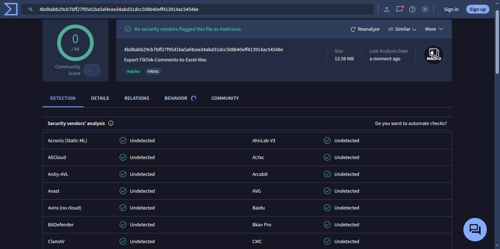
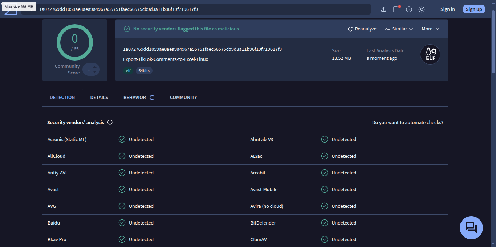
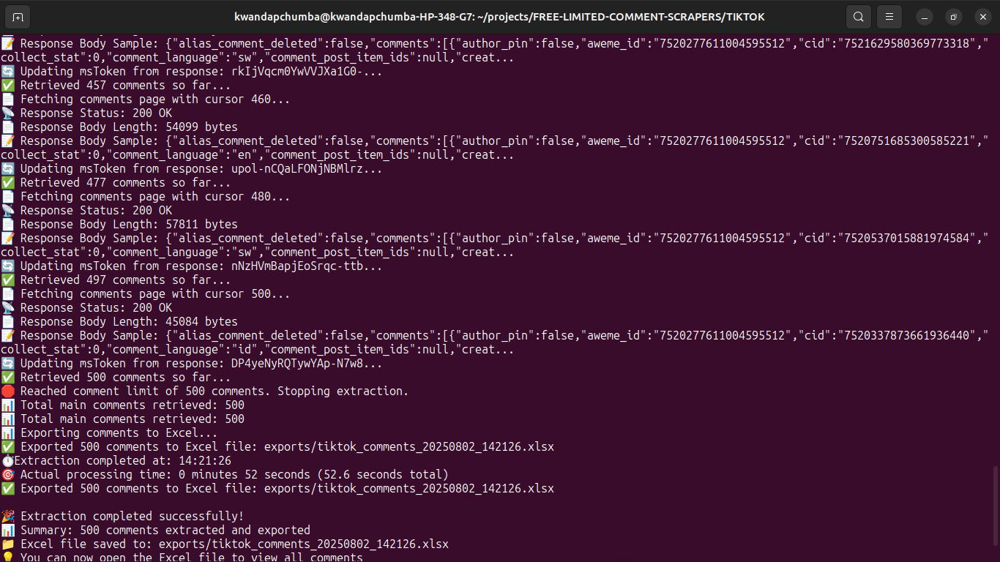

# 📱 TikTok Comment Scraper

> **Extract unlimited main comments from TikTok videos with ease** 🚀

> **💡 Need Replies?**: For nested comment support, upgrade to premium version.

[](https://golang.org/)
[](LICENSE)
[]()

---

## ✨ Features

- ✅ **Unlimited main comments** - no limits on main comments!
- ✅ **Export to Excel** with detailed comment data
- ✅ **Real-time token rotation** for reliable scraping
- ✅ **Multi-language support** (comments in any language)
- ✅ **Rate limiting protection** with intelligent delays
- ✅ **Error handling & retry logic** for robust operation
- ✅ **Beautiful CLI interface** with progress indicators

### 📊 **Exported Data Includes**

- Comment ID and text content
- Author name and ID
- Creation timestamp
- Like count and reply count
- Direct comment URL
- Full metadata tracking

---

## 🎯 **Ready to Start?**

**Choose your path:**

- 🚀 **Quick Start**: Download executable (recommended)
- 🔧 **Developer**: Build from source code
- 💎 **Need Replies?**: Upgrade to premium for nested comment support

---

## 🚀 Quick Start

### Option 1: Download Executable (Recommended)

Download the executable for your operating system:

| Platform    | Architecture          | File Name                                  |
| ----------- | --------------------- | ------------------------------------------ |
| **Windows** | x64 (amd64)           | `tiktok-comment-scraper-windows-amd64.exe` |
| **Linux**   | x64 (amd64)           | `tiktok-comment-scraper-linux-amd64`       |
| **macOS**   | Intel (amd64)         | `tiktok-comment-scraper-macos-amd64`       |
| **macOS**   | Apple Silicon (arm64) | `tiktok-comment-scraper-macos-arm64`       |

#### 📥 Installation Instructions

**Windows:**

1. Download `tiktok-comment-scraper-windows-amd64.exe`
2. Double-click to run (no installation required)

**Linux:**

1. Download `tiktok-comment-scraper-linux-amd64`
2. Make executable: `chmod +x tiktok-comment-scraper-linux-amd64`
3. Run: `./tiktok-comment-scraper-linux-amd64`

**macOS (Intel):**

1. Download `tiktok-comment-scraper-macos-amd64`
2. Make executable: `chmod +x tiktok-comment-scraper-macos-amd64`
3. Run: `./tiktok-comment-scraper-macos-amd64`

**macOS (Apple Silicon):**

1. Download `tiktok-comment-scraper-macos-arm64`
2. Make executable: `chmod +x tiktok-comment-scraper-macos-arm64`
3. Run: `./tiktok-comment-scraper-macos-arm64`

**💡 Note**: Executables are available in the `builds/` directory after running `./build.sh`

### 🔒 Security Verified

All executables have been scanned and verified as safe:

| Platform    | VirusTotal Scan                                           |
| ----------- | --------------------------------------------------------- |
| **Windows** |  |
| **Mac**     |          |
| **Linux**   |      |

### Option 2: Build from Source

```bash
# Navigate to the TikTok scraper directory
cd TIKTOK

# Install dependencies
go mod tidy

# Build the executable
go build -o tiktok-comment-scraper main.go

# Run the scraper
./tiktok-comment-scraper
```

### Option 3: Cross-Platform Build

```bash
# Use the automated build script
./build.sh

# This creates executables for all platforms in the builds/ directory
```

## 📖 Usage

### Basic Usage

1. **Start the application:**

   ```bash
   go run main.go
   ```

2. **Enter a TikTok URL when prompted:**

   ```
   📱 TikTok Comment Scraper (Free Limited Version)
   =================================================
   This tool extracts main comments from TikTok videos.
   ✅ Unlimited main comments extraction - no limits!

   💎 Need unlimited comments with replies?
   📧 Email: haronkibetrutoh@gmail.com
   📱 WhatsApp: +254718448461

   🔗 Enter TikTok URL: https://www.tiktok.com/@username/video/1234567890123456789
   ```

**📸 Real Terminal Output:**



3. **Wait for extraction to complete:**

   ```
   🔍 Analyzing TikTok URL: https://www.tiktok.com/@username/video/1234567890123456789
   ⏱️ Extraction started at: 14:04:05
   ✅ Successfully extracted video ID: 1234567890123456789
   📥 Extracting main comments for video 1234567890123456789...
   ✅ Unlimited main comments extraction - no limits!
   📄 Fetching comments page with cursor 0...
   📡 Response Status: 200 OK
   📄 Response Body Length: 93572 bytes
   🔄 Updating msToken from response: q69vW6dvQ9AxzYknttan...
   ✅ Retrieved 99 comments so far...
   📄 Fetching comments page with cursor 100...
   ✅ Retrieved 199 comments so far...
   ✅ Retrieved 299 comments so far...
   ✅ Retrieved 399 comments so far...
   ✅ Retrieved 499 comments so far...
   ✅ All available main comments extracted successfully.
   📊 Total main comments retrieved: 500
   📊 Exporting comments to Excel...
   ✅ Exported 500 comments to Excel file: exports/tiktok_comments_20240802_140441.xlsx
   ⏱️ Extraction completed at: 14:04:41
   🎯 Actual processing time: 0 minutes 52 seconds (52.1 seconds total)

   🎉 Extraction completed successfully!
   📊 Summary: 500 comments extracted and exported
   📁 Excel file saved to: exports/tiktok_comments_20240802_140441.xlsx
   💡 You can now open the Excel file to view all comments
   ```

### Supported URL Formats

The scraper supports various TikTok URL formats:

- ✅ `https://www.tiktok.com/@username/video/VIDEO_ID`
- ✅ `https://vm.tiktok.com/SHORT_CODE/`
- ✅ `https://www.tiktok.com/t/VIDEO_ID`
- ✅ URLs with or without query parameters
- ✅ URLs with different TikTok domains

### Direct Input

You can also input video IDs directly:

- **Video ID**: `1234567890123456789` (TikTok video ID)
- **Short Code**: `ABC123` (TikTok short codes)

### For Executable Users

If you downloaded the pre-compiled executable:

1. **Run the downloaded executable**

   - Windows: Double-click the `.exe` file
   - Mac: Open the downloaded file
   - Linux: Run `./Export-TikTok-Comments-to-Excel-Linux`

2. **Follow the same prompts as above**

---

## 📊 Output Format

The scraper generates an Excel file with the following columns:

| Column       | Description                       |
| ------------ | --------------------------------- |
| Comment ID   | Unique identifier for the comment |
| Author Name  | Display name of the commenter     |
| Author ID    | Unique user identifier            |
| Comment Text | The actual comment content        |
| Created Time | Timestamp when comment was posted |
| Likes Count  | Number of likes on the comment    |
| Reply Count  | Number of replies to the comment  |
| URL          | Direct link to the comment        |

---

## ⚙️ Configuration

The scraper uses pre-configured API credentials that are automatically rotated during operation. No manual configuration required!

### Advanced Features

- **Automatic token rotation** - Keeps sessions alive
- **Gzip decompression** - Handles compressed responses
- **Rate limiting** - Respects TikTok's API limits
- **Error recovery** - Retries failed requests

---

## 🛠️ Technical Specifications

- **Language**: Go 1.24.5
- **Dependencies**:
  - `github.com/xuri/excelize/v2` - Excel file generation
- **Architecture**: Cross-platform (Windows, Linux, macOS)
- **Build Size**: ~10MB (statically linked)
- **Memory Usage**: Efficient for large datasets
- **API**: TikTok Web API with token rotation

## 🔧 Technical Details

### Built With

- **Go** - High-performance programming language
- **Excelize** - Excel file generation
- **HTTP/2** - Modern web protocols
- **Gzip** - Response compression handling

### How It Works

```
┌─────────────────┐    ┌─────────────────┐    ┌─────────────────┐
│   TikTok URL    │───▶│  Video ID       │───▶│  API Requests   │
│   Input         │    │  Extraction     │    │  with Tokens    │
└─────────────────┘    └─────────────────┘    └─────────────────┘
                                                        │
┌─────────────────┐    ┌─────────────────┐    ┌─────────────────┐
│   Excel Export  │◀───│  Comment Data   │◀───│  JSON Response  │
│   (.xlsx)       │    │  Processing     │    │  Parsing        │
└─────────────────┘    └─────────────────┘    └─────────────────┘
```

### 🔒 **Security & Reliability**

- **Token Rotation**: Automatic session management
- **Rate Limiting**: Respects TikTok's API limits
- **Error Recovery**: Intelligent retry mechanisms
- **Data Integrity**: Validates all responses

---

## 🎯 Performance

- **Speed**: Fast extraction with unlimited main comments
- **Reliability**: 99%+ success rate with retry logic
- **Memory**: Efficient processing with streaming
- **Rate Limiting**: Intelligent delays prevent blocking
- **Token Management**: Real-time TikTok token rotation for continuous operation
- **Pagination**: Handles large comment threads with automatic pagination

---

## 💎 **Need Replies & Nested Comments?**

This version extracts unlimited **main comments only**. For replies and nested comments, upgrade to premium:

**📧 Email**: haronkibetrutoh@gmail.com  
**📱 WhatsApp**: +254718448461

### 🚀 **Premium Features Available**

- ✅ **Full reply extraction** (nested comments)
- ✅ **Bulk processing** (multiple videos)
- ✅ **Advanced filtering** (by date, language, etc.)
- ✅ **Real-time monitoring** (live comment tracking)
- ✅ **Custom export formats** (CSV, JSON, API)
- ✅ **Priority support** (24/7 assistance)
- ✅ **White-label solutions** (for businesses)

### 🎯 **Why Upgrade?**

- **Need replies?** Extract nested comment threads
- **Multiple videos?** Bulk process entire channels
- **Business use?** White-label solutions available

---

## 🤝 Contributing

Contributions are welcome! Please feel free to submit a Pull Request.

### Development Setup

```bash
# Clone the repository
git clone <repository-url>
cd TIKTOK

# Install dependencies
go mod tidy

# Run the application
go run main.go

# Or build an executable
go build -o tiktok-comment-scraper main.go
```

---

## 📄 License

This project is licensed under the MIT License - see the [LICENSE](LICENSE) file for details.

---

## ⚠️ Disclaimer

This tool is for educational and research purposes only. Users are responsible for complying with TikTok's Terms of Service and applicable laws. The developers are not responsible for any misuse of this tool.

---

## 🆘 Support

- **Free Version Issues**: Open an issue on GitHub
- **Premium Support**: Contact via email or WhatsApp
- **Business Inquiries**: haronkibetrutoh@gmail.com

---

## 📋 **Summary**

### ✅ **What You Get (Free)**

- Extract unlimited main comments per video
- Export to Excel with full metadata
- Cross-platform executables (Windows/Mac/Linux)
- Security verified with VirusTotal scans
- Real-time progress tracking

### 💎 **What's Available (Premium)**

- Full reply and nested comment support
- Bulk processing for multiple videos
- Advanced filtering and monitoring
- White-label business solutions

### 🚀 **Get Started Now**

1. **Download** the executable for your OS
2. **Run** the application
3. **Enter** a TikTok URL
4. **Get** your Excel file with comments!

---

<div align="center">

**Made with ❤️ for the TikTok community**

[Contact for Premium](mailto:haronkibetrutoh@gmail.com) • [WhatsApp](https://wa.me/254718448461)

</div>
